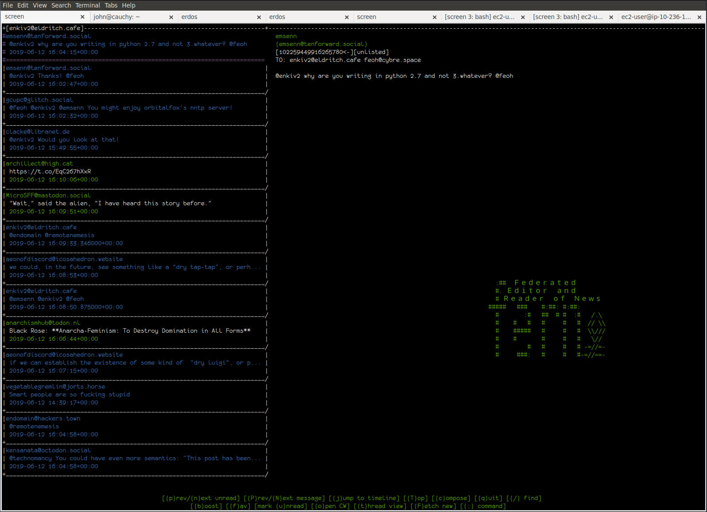

# fern
```
                            
                            
   :##  Ｆｅｄｅｒａｔｅｄ  
   #. Ｅｄｉｔｏｒ  ａｎｄ  
   # Ｒｅａｄｅｒ  ｏｆ  Ｎｅｗｓ                                                               
 #####   ###    #:##: #:##: 
   #       :#   ##  # #  :#   /.\
   #    #   #   #     #   #  // \\
   #    #####   #     #   #  \\///
   #    #       #     #   #   \//
   #        #   #     #   # -=//=-
   #     ###:   #     #   #-=//==-
                            
                            
```
[fern](fern): a curses-based mastodon client modeled off usenet news readers & pine, with an emphasis on getting to 'timeline zero'



Fern depends upon [Mastodon.py](https://github.com/halcy/Mastodon.py), and is tested on python 2.7 (though it ought to work on python 3 as well).

It was forked from [my misc repo](http://github.com/enkiv2/misc), so if you want to see the history of older commits, view it [here](https://github.com/enkiv2/misc/commits/5ac7ed618a10622f065c7e08d6e422ca478395d7/fern).

## Installation

```
	pip install Mastodon.py
	sudo make install
```

When you start fern for the first time, it will prompt you for your instance URL, email, and password. (To reset this, delete ~/.fern)

If you would like to import your existing history of posts, mentions, and favorites, type `:import_history`. This may take a long time.

## Philosophy

Fern comes out of some discussions on the fediverse about how user interface design influences behavior & how certain kinds of norms developed around reading whole threads in usenet because of the design of news clients. The UI of fern is an experiment in trying to encourage users to read entire threads, read their entire timeline, and treat the fediverse more like a medium for serious discussion (i.e., to de-twitterize the fediverse's culture with regard to sealioning).

It also tries to fill in a gap between command-line based clients like tootstream (wherein it's very easy to miss part of a thread or reply to the wrong post because the user manages IDs) and heavy, push-centered experiences like the mastodon web interface (wherein automatic loading can interrupt user input, and where the timeline can quickly get large enough to slow down your whole computer). This is a niche is shares with the likes of brutaldon.

To these ends, there are a couple general rules fern follows:

* navigation and display privileges new & meaningful content
* no operations occur without user input
* local cache is used whenever possible
* commonly-used operations ought to be one or two keystrokes
* the user shouldn't need to keep anything in mind other than the message they are reading or writing

More specifically:

* favorites are not meaningful information, and are not displayed at all (although it is possible to perform them)
* boosts are treated as duplicates of the original message (i.e., they inherit the 'read' status of the original message)
* expanding a thread is a single-keystroke operation
* skipping to the next or previous unread message is a single-keystroke operation, while navigating to the next or previous message regardless of read status requires also pressing shift
* CWs' openness is toggled globally, but the content of CW'd messages is not visible in the left-hand pane -- so, it's faster to read long threads where every item is CW'd
* messages are cached locally as soon as they are fetched or posted, and search runs against the local cache
* fetching new messages requires the user to perform the fetch operation (F) or open a thread (t)
* there is only one timeline pane (the left-hand pane), and new content is placed at the top of the timeline (even in events like thread expansion, where the entire thread is prepended to the top of the timeline)

## About the local cache

Fern caches all toots immediately after fetching them, and checks this local cache first for display. This aggressive caching is necessary because Mastodon.py lazily fetches items from the ActivityPub server as they're needed for view, which can be quite slow -- too slow for search, and sometimes too slow for rapid reading of the timeline.

This local cache is represented as a hash table keyed by message ID, and while it's a single table in memory, it's stored in 10 chunks (based on the last digit of the ID). This segmentation makes saving quicker in cases where only a few messages have been fetched.

Messages are fetched and added to the local cache if the user requests a fetch (`F`), expands a thread (`t`), requests a particular message by ID (`:open_tid`), or imports history (`:import_history`). A save occurs after each manual fetch (once per timeline) or after expanding each thread, and it also occurs upon exit.

## Missing features

Fern does not supply the ability to follow, mute, or block other users. It also doesn't allow you to mute threads, edit profile information, or change the visibility of your toots. It does not perform client-side size limit checks. It does not attempt to render HTML -- it turns both links and images into raw URLs, turns `<p>` and `<br>` tags into newlines, and strips all other tags entirely.

Fern was planned to support nuanced (killfile-like) blocking and filtering, but this has not yet been implemented.

We have no account-switching support. The most convenient way to do this right now is keep a copy of .fern for every account and swap them out, but this means that (for instance) search is limited by account.

## Flaws

Sometimes, the mastodon API doesn't give us as many messages as we ask for, or truncates the range. If you don't use fern for a couple days, you're liable to miss notifications. There must be some way to get around this, since the mastodon web client seems to be able to show arbitrarily many messages.

Fern isn't heavily tested on python3, and switching between python 2 and python 3 with the same configuration and cache can cause problems. Specifically, it can corrupt your cache, because of some changes to how strings work that are too hairy for me to fully understand.

While fern now works on 80x24 terminals, it will probably still break if your terminal is much smaller. (If this happens, you'll get an error like "Something happened: ERR in addstr()".)

## What do users say?

Drew DeVault [says](https://cmpwn.com/@sir/102261747305331627) that I'm a "moron" for supporting python2, and that my code is bad.

Feoh [says](https://cybre.space/@feoh/102259270040620552) "VERY cool"

IceWolf [says](https://meow.social/@IceWolf/102264248205395584) "700 lines of code? For an entire Mastodon client? Nice! (:"

tedu [says](https://lobste.rs/s/pmh5hg/fern_curses_based_mastodon_client#c_pmdwvz) "Good luck! (Earnestly.)"


